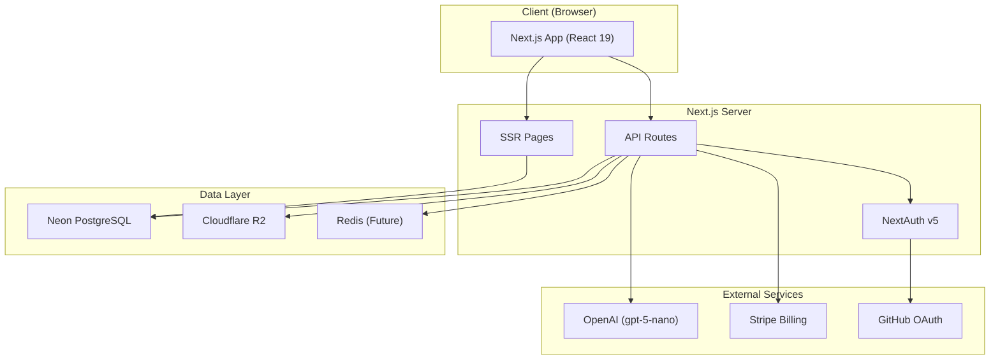
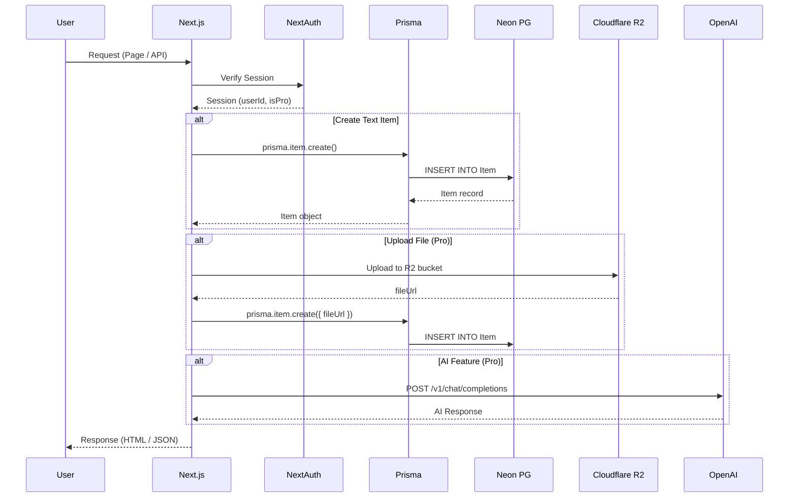
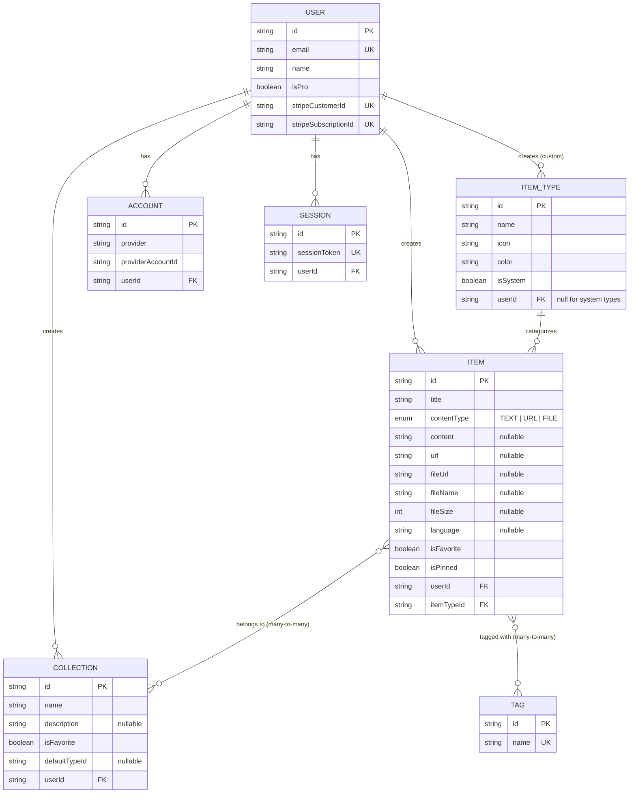
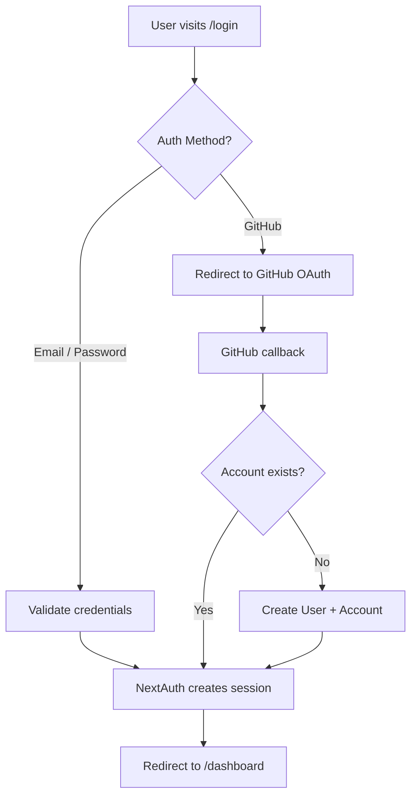
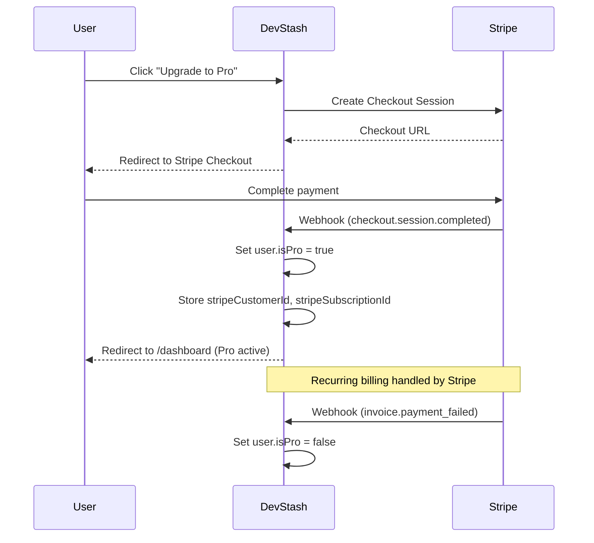

# 🗄️ DevStash — Project Overview

> **One fast, searchable, AI-enhanced hub for all developer knowledge & resources.**

---

## Table of Contents

- [Problem Statement](#-problem-statement)
- [Target Users](#-target-users)
- [Tech Stack](#-tech-stack)
- [Architecture](#-architecture)
- [Data Model (Prisma)](#-data-model-prisma)
- [Entity-Relationship Diagram](#-entity-relationship-diagram)
- [Authentication](#-authentication)
- [Features](#-features)
- [Item Types & Design Tokens](#-item-types--design-tokens)
- [Monetization](#-monetization)
- [UI/UX Guidelines](#-uiux-guidelines)
- [Key Development Rules](#-key-development-rules)

---

## 🧩 Problem Statement

Developers keep their essentials scattered across too many tools:

| What              | Where It Ends Up           |
| ----------------- | -------------------------- |
| Code snippets     | VS Code, Notion, Gists     |
| AI prompts        | ChatGPT/Claude chat logs   |
| Context files     | Buried in project dirs     |
| Useful links      | Browser bookmarks          |
| Documentation     | Random folders             |
| Terminal commands | `.txt` files, bash history |
| Project templates | GitHub Gists               |

**Result →** Context switching, lost knowledge, inconsistent workflows.

**DevStash →** A single, fast, developer-grade hub to store, search, and enhance all of it.

---

## 👤 Target Users

| Persona                           | Primary Use Case                                       |
| --------------------------------- | ------------------------------------------------------ |
| 🧑‍💻 **Everyday Developer**         | Quick access to snippets, commands, links              |
| 🤖 **AI-First Developer**         | Saves prompts, system messages, AI contexts, workflows |
| 🎓 **Content Creator / Educator** | Stores code blocks, explanations, course notes         |
| 🏗️ **Full-Stack Builder**         | Collects patterns, boilerplates, API examples          |

---

## 🛠️ Tech Stack

| Layer            | Technology                                                                        | Notes                                  |
| ---------------- | --------------------------------------------------------------------------------- | -------------------------------------- |
| **Framework**    | [Next.js 16](https://nextjs.org/) / [React 19](https://react.dev/)                | SSR pages, API routes, single repo     |
| **Language**     | [TypeScript](https://www.typescriptlang.org/)                                     | Strict mode, no `any`                  |
| **Database**     | [Neon](https://neon.tech/) (Serverless PostgreSQL)                                | Cloud-hosted, branching support        |
| **ORM**          | [Prisma 7](https://www.prisma.io/)                                                | Migration-based workflow only          |
| **Auth**         | [NextAuth v5 (Auth.js)](https://authjs.dev/)                                      | Email/password + GitHub OAuth          |
| **File Storage** | [Cloudflare R2](https://developers.cloudflare.com/r2/)                            | S3-compatible, zero egress fees        |
| **AI**           | [OpenAI](https://platform.openai.com/) — `gpt-5-nano`                             | Auto-tag, summarize, explain, optimize |
| **CSS**          | [Tailwind CSS v4](https://tailwindcss.com/) + [shadcn/ui](https://ui.shadcn.com/) | Design tokens via CSS variables        |
| **Caching**      | [Redis](https://redis.io/) _(future consideration)_                               | Session cache, distributed locking     |
| **Payments**     | [Stripe](https://stripe.com/)                                                     | Subscriptions (monthly / yearly)       |

---

## 🏛️ Architecture

### High-Level System Diagram



### Request Flow



---

## 💾 Data Model (Prisma)

> **⚠️ IMPORTANT:** Never use `db push`. All schema changes must go through versioned migrations via `prisma migrate dev` (local) and `prisma migrate deploy` (production).

```prisma
// schema.prisma

generator client {
  provider = "prisma-client-js"
}

datasource db {
  provider = "postgresql"
  url      = env("DATABASE_URL")
}

// ─────────────────────────────────────────────
// AUTH MODELS (NextAuth v5 / Auth.js)
// ─────────────────────────────────────────────

model User {
  id                   String    @id @default(cuid())
  name                 String?
  email                String    @unique
  emailVerified        DateTime?
  image                String?
  password             String?   // hashed, null for OAuth-only users

  // Pro / Billing
  isPro                Boolean   @default(false)
  stripeCustomerId     String?   @unique
  stripeSubscriptionId String?   @unique

  // Relations
  accounts             Account[]
  sessions             Session[]
  items                Item[]
  collections          Collection[]
  itemTypes            ItemType[] // user-created custom types

  createdAt            DateTime  @default(now())
  updatedAt            DateTime  @updatedAt

  @@map("users")
}

model Account {
  id                String  @id @default(cuid())
  userId            String
  type              String
  provider          String
  providerAccountId String
  refresh_token     String? @db.Text
  access_token      String? @db.Text
  expires_at        Int?
  token_type        String?
  scope             String?
  id_token          String? @db.Text
  session_state     String?

  user              User    @relation(fields: [userId], references: [id], onDelete: Cascade)

  @@unique([provider, providerAccountId])
  @@map("accounts")
}

model Session {
  id           String   @id @default(cuid())
  sessionToken String   @unique
  userId       String
  expires      DateTime

  user         User     @relation(fields: [userId], references: [id], onDelete: Cascade)

  @@map("sessions")
}

model VerificationToken {
  identifier String
  token      String   @unique
  expires    DateTime

  @@unique([identifier, token])
  @@map("verification_tokens")
}

// ─────────────────────────────────────────────
// CORE DOMAIN MODELS
// ─────────────────────────────────────────────

model ItemType {
  id        String  @id @default(cuid())
  name      String  // "snippet", "prompt", "command", etc.
  icon      String  // Lucide icon name: "Code", "Sparkles", etc.
  color     String  // Hex color: "#3b82f6"
  isSystem  Boolean @default(false)

  // null for system types, set for user-created custom types
  userId    String?
  user      User?   @relation(fields: [userId], references: [id], onDelete: Cascade)

  items     Item[]

  @@unique([name, userId]) // system types: unique by name; user types: unique per user
  @@map("item_types")
}

model Item {
  id          String   @id @default(cuid())
  title       String
  description String?  @db.Text

  // Content discriminator
  contentType ContentType @default(TEXT)
  content     String?     @db.Text  // text content (snippet, note, prompt, command)
  url         String?               // for link-type items
  fileUrl     String?               // R2 URL for file/image types
  fileName    String?               // original uploaded filename
  fileSize    Int?                  // file size in bytes

  // Metadata
  language    String?               // programming language (for code snippets)
  isFavorite  Boolean  @default(false)
  isPinned    Boolean  @default(false)

  // Relations
  userId      String
  user        User     @relation(fields: [userId], references: [id], onDelete: Cascade)

  itemTypeId  String
  itemType    ItemType @relation(fields: [itemTypeId], references: [id])

  tags        TagsOnItems[]
  collections ItemsOnCollections[]

  createdAt   DateTime @default(now())
  updatedAt   DateTime @updatedAt

  @@index([userId, itemTypeId])
  @@index([userId, isFavorite])
  @@index([userId, isPinned])
  @@index([userId, createdAt])
  @@map("items")
}

enum ContentType {
  TEXT
  URL
  FILE
}

model Collection {
  id            String   @id @default(cuid())
  name          String   // "React Hooks", "Context Files", etc.
  description   String?  @db.Text
  isFavorite    Boolean  @default(false)

  // Default type for empty collections (determines card color)
  defaultTypeId String?

  // Relations
  userId        String
  user          User     @relation(fields: [userId], references: [id], onDelete: Cascade)

  items         ItemsOnCollections[]

  createdAt     DateTime @default(now())
  updatedAt     DateTime @updatedAt

  @@index([userId])
  @@map("collections")
}

// ─────────────────────────────────────────────
// JOIN TABLES
// ─────────────────────────────────────────────

model ItemsOnCollections {
  itemId       String
  item         Item       @relation(fields: [itemId], references: [id], onDelete: Cascade)

  collectionId String
  collection   Collection @relation(fields: [collectionId], references: [id], onDelete: Cascade)

  addedAt      DateTime   @default(now())

  @@id([itemId, collectionId])
  @@map("items_on_collections")
}

model Tag {
  id    String        @id @default(cuid())
  name  String        @unique
  items TagsOnItems[]

  @@map("tags")
}

model TagsOnItems {
  itemId String
  item   Item   @relation(fields: [itemId], references: [id], onDelete: Cascade)

  tagId  String
  tag    Tag    @relation(fields: [tagId], references: [id], onDelete: Cascade)

  @@id([itemId, tagId])
  @@map("tags_on_items")
}
```

---

## 📊 Entity-Relationship Diagram



---

## 🔐 Authentication

### Strategy: NextAuth v5 (Auth.js)

| Provider         | Flow                                                           |
| ---------------- | -------------------------------------------------------------- |
| **Credentials**  | Email + hashed password (bcrypt). Custom sign-up page.         |
| **GitHub OAuth** | One-click sign-in. Merges with existing account if same email. |

### Auth Flow



### Protected Routes

- All `/dashboard/*` routes require authentication (middleware).
- API routes validate session via `auth()` helper.
- Unauthenticated users see landing page + sign-in/sign-up.

---

## ✨ Features

### A. Items & Item Types

Items are the core unit of DevStash. Each item has a **type** that determines its behavior and appearance.

**System Types** (immutable, available to all users):

| Type      | Content Type | Icon         | Color                | Tier |
| --------- | ------------ | ------------ | -------------------- | ---- |
| `snippet` | `TEXT`       | `Code`       | `#3b82f6` 🔵 Blue    | Free |
| `prompt`  | `TEXT`       | `Sparkles`   | `#8b5cf6` 🟣 Purple  | Free |
| `command` | `TEXT`       | `Terminal`   | `#f97316` 🟠 Orange  | Free |
| `note`    | `TEXT`       | `StickyNote` | `#fde047` 🟡 Yellow  | Free |
| `link`    | `URL`        | `Link`       | `#10b981` 🟢 Emerald | Free |
| `file`    | `FILE`       | `File`       | `#6b7280` ⚫ Gray    | Pro  |
| `image`   | `FILE`       | `Image`      | `#ec4899` 🩷 Pink    | Pro  |

**Custom Types** (Pro, future feature): Users can create their own types with custom names, icons, and colors.

**URL Pattern:** `/items/:typeName` → e.g., `/items/snippets`, `/items/prompts`

**UX:** Items open in a fast slide-out drawer for quick access and creation.

---

### B. Collections

Flexible grouping of items across types.

- A collection can hold items of **any type** (e.g., "React Patterns" → snippets + notes + links).
- An item can belong to **multiple collections** (many-to-many).
- Collections display as **color-coded cards** — background color determined by the dominant item type.

**Examples:**

| Collection Name | Typical Contents       |
| --------------- | ---------------------- |
| React Patterns  | snippets, notes        |
| Context Files   | files, prompts         |
| Python Snippets | snippets               |
| Interview Prep  | snippets, notes, links |
| Prompt Library  | prompts                |

---

### C. Search

Full-text search across:

- 📝 **Content** (body text, code)
- 🏷️ **Tags**
- 📌 **Titles**
- 📂 **Types**

> Future: Consider PostgreSQL full-text search (`tsvector`) or a dedicated search engine for scale.

---

### D. Additional Features

| Feature                        | Description                                           | Tier |
| ------------------------------ | ----------------------------------------------------- | ---- |
| ⭐ Favorites                   | Favorite collections and items for quick access       | Free |
| 📌 Pin to Top                  | Pin important items above the rest                    | Free |
| 🕐 Recently Used               | Track and surface recently accessed items             | Free |
| 📥 Import from File            | Upload a code file to create a snippet                | Free |
| ✍️ Markdown Editor             | Rich editor for text-type items                       | Free |
| 📎 File Upload                 | Upload files/images to Cloudflare R2                  | Pro  |
| 📤 Export Data                 | Export as JSON / ZIP                                  | Pro  |
| 🌙 Dark Mode                   | Default theme, with light mode toggle                 | Free |
| 🔀 Multi-collection Assignment | Add/remove items to/from multiple collections at once | Free |
| 👁️ Collection Membership View  | See which collections an item belongs to              | Free |

---

### E. AI Features (Pro Only)

| Feature                 | Description                                             | API Endpoint Pattern     |
| ----------------------- | ------------------------------------------------------- | ------------------------ |
| 🏷️ Auto-Tag Suggestions | AI analyzes content and suggests relevant tags          | `POST /api/ai/auto-tag`  |
| 📝 AI Summaries         | Generate a concise summary of long items                | `POST /api/ai/summarize` |
| 🔍 Explain This Code    | AI provides a line-by-line explanation of code snippets | `POST /api/ai/explain`   |
| ✨ Prompt Optimizer     | Rewrites and improves AI prompts for better output      | `POST /api/ai/optimize`  |

**Model:** OpenAI `gpt-5-nano` — fast, cost-effective for utility tasks.

---

## 🎨 Item Types & Design Tokens

### CSS Variables (Design Tokens)

```css
/* Item Type Color Tokens */
:root {
  --type-snippet-color: #3b82f6; /* Blue   */
  --type-prompt-color: #8b5cf6; /* Purple */
  --type-command-color: #f97316; /* Orange */
  --type-note-color: #fde047; /* Yellow */
  --type-file-color: #6b7280; /* Gray   */
  --type-image-color: #ec4899; /* Pink   */
  --type-link-color: #10b981; /* Emerald */
}
```

### Lucide Icon Mapping

```typescript
// lib/item-type-config.ts

import {
  Code,
  Sparkles,
  Terminal,
  StickyNote,
  FileText,
  Image,
  Link,
  type LucideIcon,
} from "lucide-react";

export interface ItemTypeConfig {
  name: string;
  icon: LucideIcon;
  color: string;
  contentType: "TEXT" | "URL" | "FILE";
  proOnly: boolean;
}

export const SYSTEM_ITEM_TYPES: Record<string, ItemTypeConfig> = {
  snippet: {
    name: "Snippet",
    icon: Code,
    color: "#3b82f6",
    contentType: "TEXT",
    proOnly: false,
  },
  prompt: {
    name: "Prompt",
    icon: Sparkles,
    color: "#8b5cf6",
    contentType: "TEXT",
    proOnly: false,
  },
  command: {
    name: "Command",
    icon: Terminal,
    color: "#f97316",
    contentType: "TEXT",
    proOnly: false,
  },
  note: {
    name: "Note",
    icon: StickyNote,
    color: "#fde047",
    contentType: "TEXT",
    proOnly: false,
  },
  link: {
    name: "Link",
    icon: Link,
    color: "#10b981",
    contentType: "URL",
    proOnly: false,
  },
  file: {
    name: "File",
    icon: FileText,
    color: "#6b7280",
    contentType: "FILE",
    proOnly: true,
  },
  image: {
    name: "Image",
    icon: Image,
    color: "#ec4899",
    contentType: "FILE",
    proOnly: true,
  },
} as const;
```

---

## 💰 Monetization

### Freemium Model

```mermaid
graph LR
    subgraph Free["🆓 Free Tier"]
        F1["50 items total"]
        F2["3 collections"]
        F3["5 system types (text + url)"]
        F4["Basic search"]
        F5["Favorites & Pins"]
        F6["Dark mode"]
    end

    subgraph Pro["⭐ Pro — $8/mo or $72/yr"]
        P1["Unlimited items"]
        P2["Unlimited collections"]
        P3["File & Image uploads"]
        P4["Custom types (future)"]
        P5["AI auto-tagging"]
        P6["AI code explanation"]
        P7["AI prompt optimizer"]
        P8["Export (JSON/ZIP)"]
        P9["Priority support"]
    end

    Free --> |"Upgrade"| Pro
```



### Tier Limits (Constants)

```typescript
// lib/tier-limits.ts

export const TIER_LIMITS = {
  FREE: {
    maxItems: 50,
    maxCollections: 3,
    fileUpload: false,
    aiFeatures: false,
    customTypes: false,
    exportData: false,
  },
  PRO: {
    maxItems: Infinity,
    maxCollections: Infinity,
    fileUpload: true,
    aiFeatures: true,
    customTypes: true,
    exportData: true,
  },
} as const;

export const PRO_PRICING = {
  monthly: 8_00, // $8.00 in cents (Stripe format)
  yearly: 72_00, // $72.00 in cents
} as const;
```

### Stripe Integration Flow



> **Dev Note:** During development, all users have full access. Pro gating will be enforced closer to launch.

---

## 🎨 UI/UX Guidelines

### Design Philosophy

| Principle       | Detail                                                                                    |
| --------------- | ----------------------------------------------------------------------------------------- |
| **Aesthetic**   | Modern, minimal, developer-focused                                                        |
| **Theme**       | Dark mode default, light mode optional                                                    |
| **Typography**  | Clean, monospace for code, sans-serif for UI                                              |
| **Spacing**     | Generous whitespace, breathing room                                                       |
| **Depth**       | Subtle borders and shadows, layered surfaces                                              |
| **Inspiration** | [Notion](https://notion.so), [Linear](https://linear.app), [Raycast](https://raycast.com) |

### Design References

### Screenshots

Refer to the screenshots in the below directory as a base for the dashboard UI. It does not have to be exact. Use it as a reference.
@context/screenshots/dashboard/

### Layout Architecture

```mermaid
graph LR
    subgraph Sidebar["Sidebar (Collapsible)"]
        S1["🔍 Search"]
        S2["📂 Item Types"]
        S3["└─ Snippets"]
        S4["└─ Prompts"]
        S5["└─ Commands"]
        S6["└─ Notes"]
        S7["└─ Links"]
        S8["└─ Files ⭐"]
        S9["└─ Images ⭐"]
        S10["📚 Latest Collections"]
    end

    subgraph Main["Main Content"]
        M1["Collection Grid (color-coded cards)"]
        M2["Item Grid (type-colored borders)"]
    end

    subgraph Drawer["Slide-Out Drawer"]
        D1["Item detail / editor"]
        D2["Create new item"]
    end

    Sidebar --> Main
    Main --> Drawer
```



### Card Color Logic

- **Collection cards:** Background color tinted by the dominant item type color.
- **Item cards:** Left border or accent color from the item's type color.
- **Empty collections:** Use `defaultTypeId` color if set, otherwise neutral gray.

### Responsive Strategy

| Breakpoint              | Behavior                                         |
| ----------------------- | ------------------------------------------------ |
| **Desktop** (≥1024px)   | Sidebar persistent + main content                |
| **Tablet** (768–1023px) | Sidebar collapsible, overlay on toggle           |
| **Mobile** (<768px)     | Sidebar becomes a bottom drawer / hamburger menu |

### Micro-Interactions

- ✅ Smooth transitions on route changes and panel toggles
- ✅ Hover states on all interactive cards and buttons
- ✅ Toast notifications for CRUD actions (create, delete, copy, etc.)
- ✅ Skeleton loading states during data fetches
- ✅ Syntax highlighting for code blocks (e.g., via [Shiki](https://shiki.style/) or [Prism](https://prismjs.com/))

---

## ⚙️ Key Development Rules

### Database

- ❌ **NEVER** use `prisma db push` — always use `prisma migrate dev` (local) / `prisma migrate deploy` (prod).
- ✅ All schema changes must be version-controlled migration scripts.
- ✅ Use indexes for all frequently queried columns (see Prisma schema above).

### Code Quality

- ✅ TypeScript strict mode — no `any` types.
- ✅ Explicit interfaces and types for all data structures.
- ✅ Follow [Conventional Commits](https://www.conventionalcommits.org/) (`feat:`, `fix:`, `chore:`, `refactor:`).

### Auth & Security

- ✅ All `/dashboard/*` routes protected via NextAuth middleware.
- ✅ API routes validate session before processing.
- ✅ Passwords hashed with bcrypt (never stored in plaintext).
- ✅ File uploads validated for type and size before R2 upload.

### Pro Feature Gating

- ✅ Foundation for pro checks built from day one.
- ✅ During development, all users treated as Pro.
- ✅ Gating enforced at both UI (hide/disable) and API (reject with 403) layers.

### Styling

- ✅ Use Tailwind CSS v4 utility classes + shadcn/ui components.
- ✅ All colors via CSS variables / design tokens — zero hardcoded hex in components.
- ✅ Dark mode via Tailwind's `dark:` variant, defaulting to dark.

---

## 📁 Proposed Directory Structure

```
devstash/
├── prisma/
│   ├── schema.prisma
│   ├── migrations/
│   └── seed.ts                    # Seed system item types
├── src/
│   ├── app/
│   │   ├── (auth)/
│   │   │   ├── login/
│   │   │   └── register/
│   │   ├── (dashboard)/
│   │   │   ├── layout.tsx         # Sidebar + main layout
│   │   │   ├── page.tsx           # Dashboard home (collections grid)
│   │   │   ├── items/
│   │   │   │   └── [type]/        # /items/snippets, /items/prompts, etc.
│   │   │   └── collections/
│   │   │       └── [id]/          # Individual collection view
│   │   ├── api/
│   │   │   ├── items/
│   │   │   ├── collections/
│   │   │   ├── tags/
│   │   │   ├── ai/
│   │   │   │   ├── auto-tag/
│   │   │   │   ├── summarize/
│   │   │   │   ├── explain/
│   │   │   │   └── optimize/
│   │   │   ├── upload/
│   │   │   └── webhooks/
│   │   │       └── stripe/
│   │   ├── layout.tsx
│   │   └── page.tsx               # Landing page
│   ├── components/
│   │   ├── ui/                    # shadcn/ui components
│   │   ├── layout/
│   │   │   ├── sidebar.tsx
│   │   │   └── header.tsx
│   │   ├── items/
│   │   │   ├── item-card.tsx
│   │   │   ├── item-drawer.tsx
│   │   │   └── item-form.tsx
│   │   └── collections/
│   │       ├── collection-card.tsx
│   │       └── collection-form.tsx
│   ├── lib/
│   │   ├── prisma.ts              # Prisma client singleton
│   │   ├── auth.ts                # NextAuth config
│   │   ├── r2.ts                  # R2 upload helpers
│   │   ├── openai.ts              # OpenAI client
│   │   ├── stripe.ts              # Stripe helpers
│   │   ├── item-type-config.ts    # System type definitions
│   │   └── tier-limits.ts         # Free vs Pro limits
│   ├── hooks/
│   │   ├── use-items.ts
│   │   └── use-collections.ts
│   └── types/
│       └── index.ts               # Shared TypeScript interfaces
├── public/
├── context/
│   └── project-overview.md        # This file
├── .env.local                     # Environment variables (git-ignored)
├── package.json
├── tsconfig.json
├── tailwind.config.ts
└── next.config.ts
```

---

## 🌱 Seed Data (System Item Types)

The following system types should be seeded on first migration:

```typescript
// prisma/seed.ts

import { PrismaClient } from "@prisma/client";

const prisma = new PrismaClient();

const SYSTEM_TYPES = [
  { name: "snippet", icon: "Code", color: "#3b82f6", isSystem: true },
  { name: "prompt", icon: "Sparkles", color: "#8b5cf6", isSystem: true },
  { name: "command", icon: "Terminal", color: "#f97316", isSystem: true },
  { name: "note", icon: "StickyNote", color: "#fde047", isSystem: true },
  { name: "link", icon: "Link", color: "#10b981", isSystem: true },
  { name: "file", icon: "File", color: "#6b7280", isSystem: true },
  { name: "image", icon: "Image", color: "#ec4899", isSystem: true },
];

async function main() {
  console.log("🌱 Seeding system item types...");

  for (const type of SYSTEM_TYPES) {
    await prisma.itemType.upsert({
      where: {
        name_userId: { name: type.name, userId: null as unknown as string },
      },
      update: {},
      create: type,
    });
  }

  console.log("✅ Seed complete.");
}

main()
  .catch((e) => {
    console.error(e);
    process.exit(1);
  })
  .finally(() => prisma.$disconnect());
```

> **Note:** The `upsert` with `name_userId` composite unique ensures idempotent seeding. The `userId` will need special handling for `null` system types — adjust the `where` clause based on Prisma 7's null handling in composite uniques.

---

_Last updated: 2026-06-20_
